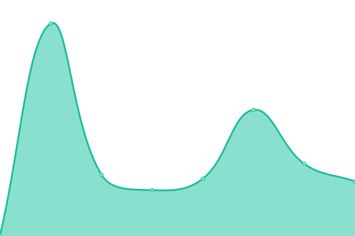
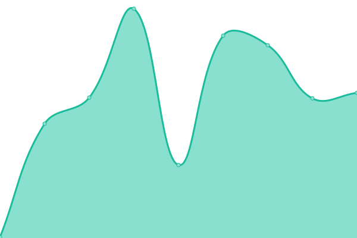

# [📈 Live Status](https://soumendrasaha.github.io/upptimenew): <!--live status--> **🟩 All systems operational**

This repository contains the open-source uptime monitor and status page for [soumendrasaha](https://soumendrasaha.github.io/upptimenew), powered by [Upptime](https://github.com/upptime/upptime).

With [Upptime](https://upptime.js.org), you can get your own unlimited and free uptime monitor and status page, powered entirely by a GitHub repository. We use [Issues](https://github.com/soumendrasaha/upptimenew/issues) as incident reports, [Actions](https://github.com/soumendrasaha/upptimenew/actions) as uptime monitors, and [Pages](https://soumendrasaha.github.io/upptimenew) for the status page.

<!--start: status pages-->
<!-- This summary is generated by Upptime (https://github.com/upptime/upptime) -->
<!-- Do not edit this manually, your changes will be overwritten -->
<!-- prettier-ignore -->
| URL | Status | History | Response Time | Uptime |
| --- | ------ | ------- | ------------- | ------ |
|  [Google](http://google.com/) | 🟩 Up | [google.yml](https://github.com/soumendrasaha/upptimenew/commits/HEAD/history/google.yml) | 

 95ms
     
 | 

<a href="https://soumendrasaha.github.io/upptimenew/history/google">100.00%</a>
    

|  [GetDocSocks-Test](https://www.getdocsocks.com/test-upptime) | 🟩 Up | [get-doc-socks-test.yml](https://github.com/soumendrasaha/upptimenew/commits/HEAD/history/get-doc-socks-test.yml) | 

 357ms
     
 | 

<a href="https://soumendrasaha.github.io/upptimenew/history/get-doc-socks-test">100.00%</a>
    

<!--end: status pages-->

[**Visit our status website →**](https://soumendrasaha.github.io/upptimenew)

## 📄 License

- Powered by: [Upptime](https://github.com/upptime/upptime)
- Code: [MIT](./LICENSE) © [soumendrasaha](https://soumendrasaha.github.io/upptimenew)
- Data in the `./history` directory: [Open Database License](https://opendatacommons.org/licenses/odbl/1-0/)
